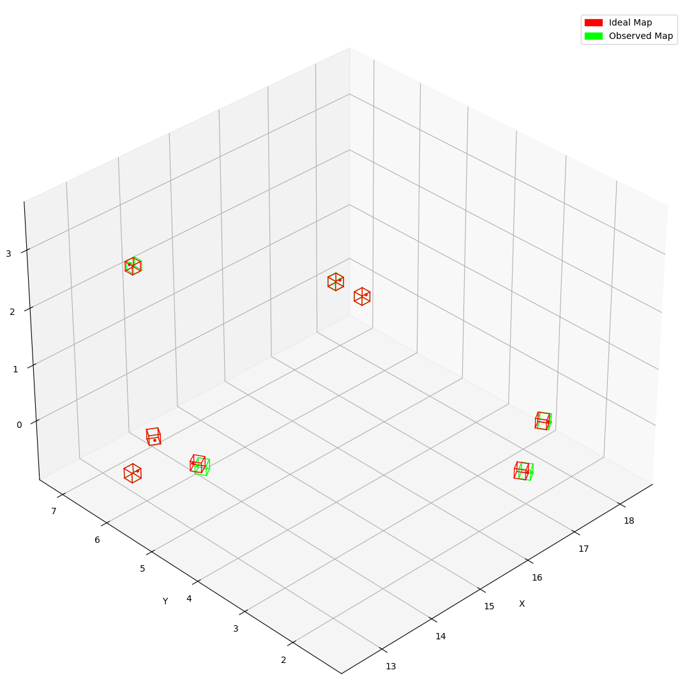

# Field Calibrator
Calibrate relative positions of Apriltags on the field



## Guide
### Clone repository
```
$ git clone --recurse-submodules https://github.com/TheHolyCows/cowlibration-field
```

### Build
```
$ cmake --preset=default
$ cmake --build build
```

### Install Python dependencies
```
$ pip install -r requirements.txt
```

### Usage
1. Prepare a calibrated camera model
    * See [https://github.com/TheHolyCows/cowlibration-camera](https://github.com/TheHolyCows/cowlibration-camera) for calibrating your camera
2. Record a video of the field's AprilTags
3. Run field calibrator
```
$ ./build/FieldCalibrator \
    --input-dir [input video directory path] \
    --camera-model [input camera model path] \
    --ideal-map [input ideal field map path] \
    --output-file [output calibrated field map path] \
    --fps [detection fps] \
    --tag-size [tag size in meters]
```

### Visualize
```
$ python scripts/visualize.py [ideal field map path] [observed field map path]
```

## Example
This repo contains a [sample camera model](data/camera_models/iphone_12_with_correction.json) and [sample field videos](data/input_champs_blue/). The below commands run the field calibration tool on the sample data and visualizes the generated field map.
```
$ ./build/FieldCalibrator                                            \
    --input-dir data/input_champs_blue/                              \
    --camera-model data/camera_models/iphone_12_with_correction.json \
    --ideal-map data/field_maps/2024-crescendo.json                  \
    --output-file data/field_maps/2024-champs-blue.json              \
    --fps 15                                                         \
    --tag-size 0.1651                                                \
    --pin-tag 7

$ python scripts/visualize.py data/field_maps/2024-crescendo.json data/field_maps/2024-champs-blue.json
```